# jual-bola-DLL

Tautan menuju aplikasi PWS yang sudah di-deploy:
[https://gibran-tegar-jualboladll.pbp.cs.ui.ac.id/](https://gibran-tegar-jualboladll.pbp.cs.ui.ac.id/)

---

## Step-by-step cara mengimplementasikan checklist:

1.  Membuat sebuah repositori lokal dengan nama `jual-bola-DLL`, membuat dokumen `requirements.txt` untuk menginstall dependencies dari project ini.
2.  Menyalakan virtual environment dengan command dibawah untuk membuat virtual environment:
    ```bash
    python -m venv env
    ```
    Dan menyalakan virtual environment dengan command dibawah:
    ```bash
    env\Scripts\activate
    ```
3.  Menginstall seluruh library pada `requirements` di dalam virtual environment.
4.  Membuat sebuah project Django baru pada repository lokal baru yang sudah dibuat dengan nama `jual-bola-DLL`.
    ```bash
    django-admin startproject jual_bola_DLL .
    ```
5.  Membuat dua file `.env` yaitu untuk dev di lokal yaitu `.env` dan untuk deployment `.env.prod` yang diisi kredensial DB.
6.  Mengubah konfigurasi-konfigurasi pada `settings.py`:

    -   Menambahkan host production pada `ALLOWED_HOSTS`:
        ```python
        ALLOWED_HOSTS = ["localhost", "127.0.0.1", "gibran-tegar-jualboladll.pbp.cs.ui.ac.id"]
        ```
    -   Menambahkan kode untuk me-load environment variables:
        ```python
        import os
        from dotenv import load_dotenv
        load_dotenv()
        ```
    -   Mengubah konfigurasi database agar fleksibel untuk environment lokal (SQLite) dan production (PostgreSQL):
        ```python
        if PRODUCTION:
            DATABASES = {
                'default': {
                    'ENGINE': 'django.db.backends.postgresql',
                    'NAME': os.getenv('DB_NAME'),
                    'USER': os.getenv('DB_USER'),
                    'PASSWORD': os.getenv('DB_PASSWORD'),
                    'HOST': os.getenv('DB_HOST'),
                    'PORT': os.getenv('DB_PORT'),
                    'OPTIONS': {
                        'options': f"-c search_path={os.getenv('SCHEMA', 'public')}"
                    }
                }
            }
        else:
            DATABASES = {
                'default': {
                    'ENGINE': 'django.db.backends.sqlite3',
                    'NAME': BASE_DIR / 'db.sqlite3',
                }
            }
        ```
7.  Membuat aplikasi `main`:
    ```bash
    python manage.py startapp main
    ```
    dan menambahkan `'main'` pada `INSTALLED_APPS` di `settings.py`.

8.  Mengubah `models.py` menjadi berikut sesuai keterangan tugas:
    ```python
    class Product(models.Model):
        name = models.CharField()
        price = models.IntegerField()
        description = models.TextField()
        thumbnail = models.URLField()
        category = models.CharField()
        is_featured = models.BooleanField(default = False)
    ```
9.  Melakukan migrasi model agar Django membuat necessary SQL commands untuk mengubah database:
    -   Membuat file migrasi yang berisi changes yang baru:
        ```bash
        python manage.py makemigrations
        ```
    -   Mengubah database sesuai dengan yang ada di file migrasi:
        ```bash
        python manage.py migrate
        ```
10. Mengubah file `views.py` yang ada di app `main` menjadi:
    ```python
    def show_main(request):
        context = {
            'nama_toko' : 'Jual Bola DLL',
            'nama_pembuat' : 'Gibran Tegar Ramadhan Putra Lynardi',
            'kelas_pbp' : 'PBP D'
        }

        return render(request, "main.html", context)
    ```
11. Melakukan Routing dari client request ke `urls.py` di level project untuk ditujukan pada `path('', include('main.urls'))`, lalu masuk ke `urls.py` di level app `main` dan menemukan pola `path('', show_main, name='show_main')`, agar masuk ke `views.py` fungsi `show_main`.

12. Membuat repo github dengan nama yang sama. Menambahkan `.gitignore`. Melakukan `git add`, `commit`, dan `push` pada repo remote. Dengan branch `main` dan `master`.

13. Deploy ke PWS dan menjalankan command yang tertera pada laman PWS.

---

## Bagan request client dan responsenya



Pengguna meminta halaman, `urls.py` bertindak seperti peta yang mengarahkan permintaan ke fungsi yang benar di `views.py`. `Views.py` akan menggunakan `models.py` untuk mengambil data dari database. Setelah data didapat, view memasukkannya ke dalam sebuah templat HTML untuk membuat halaman web final yang dikirim kembali ke pengguna.

---

## Peran settings.py di Django

Pada tugas\_individu ini so far, `settings.py` sudah berguna untuk mengubah konfigurasi database sesuai penggunaan entah dalam production atau tidak. Kita juga mendaftarkan aplikasi pada `INSTALLED_APPS` agar aplikasi tersebut dikenali oleh django. Ada juga `ALLOWED_HOSTS` untuk menentukan domain yang boleh menjalankan app ini.
Terdapat juga fungsi-fungsi lain yaitu konfigurasi middleware dan template. Jadi kegunaan `settings.py` adalah untuk menentukan konfigurasi-konfigurasi utama agar saling terhubung.

---

## Cara kerja migrasi database di Django

Dari tugas\_individu ini, singkatnya kita akan melakukan perubahan pada `models.py` dulu di mana ini adalah representasi struktur database yang terlihat. Lalu kita menjalankan `python manage.py makemigrations` untuk membuat file migrasi apa saja yang harus diubah. Setelah itu menjalankan `python manage.py migrate` untuk benar-benar mengaplikasikan perubahan tersebut ke database ini dengan translating file migrasi itu menjadi perintah-perintah SQL yang diperlukan.

---

## Alasan Django digunakan sebagai permulaan

Menurut saya, Django digunakan karena menggunakan bahasa python yang memang tergolong lebih mudah untuk digunakan dibandingkan bahasa-bahasa lain. Struktur project nya juga benar-benar terdefine dari awal dan memang harus diikuti agar tidak berantakan.

---

## Apakah ada feedback untuk asisten dosen tutorial 1 yang telah kamu kerjakan sebelumnya?

Tidak ada, sudah sangat komprehensif sehingga jika belajar dari tutorial 1 sudah dapat mengaplikasikannya sendiri. Terima kasih banyakk kakak kakak asdoss! Mungkin jika memungkinkan beberapa tambahan troubleshooting disediakan juga jika memungkinkan.

## TUGAS INDIVIDU 2

## 1.
Data delivery diperlukan dikarenakan jika kita mengimplementasikan sebuah aplikasi pada suatu platform, maka akan ada user yang menggunakan aplikasi tersebut. User akan mengirimkan data-data pada client side dan diproses pada server side untuk dikembalikan kembali ke user. Jika tidak ada delivery maka kita tidak dapat melakukan transaksi data antara user dan server.

## 2.
JSON menurutku lebih baik karena segi syntax saja dan juga readability. XML menurutku terlalu rigid untuk dilihat dan dibaca sementara JSON menggunakan model dictionary. Karena banyak aplikasi web yang menggunakan RestAPI, JSON lebih sering digunakan dan meningkat popularitasnya.

## 3.
is_valid() basically pencegah data yang imperfect. Method tersebut akan mengecek apakah data mengikuti semua parameter dan constraints dari tipe field yang digunakan. Kita membutuhkan method tersebut karena basically kita ga akan percaya apa yang user berikan, juga membantu user untuk memberikan data yang benar.

## 4.
Mengapa kita membutuhkan csrf_token saat membuat form di Django? Apa yang dapat terjadi jika kita tidak menambahkan csrf_token pada form Django? Bagaimana hal tersebut dapat dimanfaatkan oleh penyerang?

ada sebuah attack bernama Cross-Site Request Forgery (CSRF) di mana akan ada aksi yang sebenarnya bukan sesuai keinginan user. Namun dengan csrf_token, permintaan POST tanpa csrf_token yang valid akan mengembalikan halaman html error sehingga web terlindungi.

## 5.
1.  Menambahkan path-path baru untuk method-method views baru yaitu
    ```python
    path('create-product/', create_product, name='create_product'),
    path('product/<str:id>/', show_product, name='show_product'),
    path('xml', show_xml, name ='show_xml'),
    path('json', show_json, name='show_json'),
    path('xml/<str:news_id>/', show_xml_by_id, name='show_xml_by_id'),
    path('json/<str:news_id>/', show_json_by_id, name='show_json_by_id'),
    ```
2.  membuat method method yang akan menampilkan template html di views.py
    ```python
    def create_product(request):
        form = ProductForm(request.POST or None)

        if form.is_valid() and request.method == "POST":
            form.save()
            return redirect('main:show_main') 

        context = {'form': form}
        return render(request, "create_product.html", context)

    def show_product(request, id):
        product = get_object_or_404(Product, pk=id)

        context = {
            'product': product
        }

        return render(request, "product_detail.html", context)

    def show_xml(request):
        product_list = Product.objects.all()
        xml_data = serializers.serialize("xml", product_list)
        return HttpResponse(xml_data, content_type="application/xml")

    def show_json(request):
        product_list = Product.objects.all()
        json_data = serializers.serialize("json", product_list)
        return HttpResponse(json_data, content_type="application/json")

    def show_xml_by_id(request, product_id):
       try:
           product_item = Product.objects.filter(pk=product_id)
           xml_data = serializers.serialize("xml", product_item)
           return HttpResponse(xml_data, content_type="application/xml")
       except Product.DoesNotExist:
           return HttpResponse(status=404)

    def show_json_by_id(request, product_id):
       try:
           product_item = Product.objects.get(pk=product_id)
           json_data = serializers.serialize("json", [product_item])
           return HttpResponse(json_data, content_type="application/json")
       except Product.DoesNotExist:
           return HttpResponse(status=404)
    ```
3.  Membuat base.html agar html-html file semua selaras strukturnya mengikuti parent file yaitu base.html.
    ```html
    
    <!DOCTYPE html>
    <html lang="en">
    <head>
        <meta charset="UTF-8" />
        <meta name="viewport" content="width=device-width, initial-scale=1.0" />
         
    </head>

    <body>
         
    </body>
    </html>
    ```
4.  Menambahkan file baru di root yaitu forms.py berisi class form untuk menambahkan produk dengan fields yang diambil untuk diisi user adalah sesuai di models.py
    ```python
    class ProductForm(ModelForm):
        class Meta:
            model = Product
            fields = ["name", "price", "description", "thumbnail", "category", "is_featured"]
    ```
5.  membuat 2 file HTML baru di main (create_product untuk halaman di mana pengguna mengisi product form) dan (product_detail untuk user melihat detail dari produk) dan juga mengubah main.html untuk inherit base.html

6.  Menambahkan domain URL PWS di CSRF_TRUSTED_ORIGINS di settings.py agar dibolehkan oleh django untuk menerima data dari user di web tersebut.
    ```python
    CSRF_TRUSTED_ORIGINS = [
        "[https://gibran-tegar-jualboladll.pbp.cs.ui.ac.id](https://gibran-tegar-jualboladll.pbp.cs.ui.ac.id)"
    ]
    ```
7.  Menambahkan root/templates ke DIRS di TEMPLATES settings.py agar base.html menjadi berkas template

## 6. Feedback untuk asdos
Tidak ada, materi yang disajikan pada tutorial 2 sudah sangat komprehensif dan detail sehingga mahasiswa mudah menyerap materi nya. Terima kasih kak! 


## TUGAS INDIVIDU 4

### Apa itu Django AuthenticationForm? Jelaskan juga kelebihan dan kekurangannya.

Jika kita pertimbangkan model pada `models.py` yang merupakan representasi dari struktur data yang akan disimpan pada database (misalnya `Product` yang menyimpan nama, dll), lalu jika kita memanggil `create_product` di mana kita bisa mengisi produk baru sesuai dengan ketentuan `ProductForm` di mana ada *fields* seperti `name`, `price`, dll. Maka `AuthenticationForm` juga sama, `AuthenticationForm` merupakan sebuah *class precoded* di Django TAPI *inherit* dari `forms.Form` untuk membuat form dengan data yang diterima yaitu *username* dan juga *password*, tapi `AuthenticationForm` hanya memvalidasi dan tidak terhubung pada suatu Model.

**Kelebihan** dari `AuthenticationForm` adalah kontrol yang penuh juga kemudahan untuk menggunakan. Jika dibandingkan AaaS seperti Auth0, data yang kita miliki ada di di database kita sehingga kita punya *full data ownership and control*. *Simplicity* juga ada dibandingkan menggunakan servis autentikasi lain di mana kita harus ada *third-party SDK*, *API keys*, dll.

Sementara **kekurangan** dari `AuthenticationForm` adalah kurangnya fitur autentikasi tambahan seperti menggunakan SSO, 2FA, dll.

---

### Apa perbedaan antara autentikasi dan otorisasi? Bagaimana Django mengimplementasikan kedua konsep tersebut?

Dalam konsep holistik, **autentikasi** berarti pengecekan identitas user sementara **otorisasi** mengatur *permission* dan apa saja yang boleh dilakukan user.

Django mengimplementasikan kedua konsep tersebut dengan menyediakan *class* `AuthenticationForm` atau lebih tepatnya dari `django.contrib.auth` yang ada fungsi `login`, `authenticate`. Sementara otorisasi diatur Django dengan *permissions* seperti `user.has_perm`, lalu *permission user* sesuai *role* pada model `User`, dan *decorator* seperti `@login_required`.

---

### Apa saja kelebihan dan kekurangan session dan cookies dalam konteks menyimpan state di aplikasi web?

**Kelebihan** utamanya adalah memberikan *"holding state"* pada HTTP yang *stateless*. Selain itu, *session* dan *cookies* bekerja sama dengan cara *session* membuat file yang isinya adalah data-data termasuk data privat pengguna dan memberikan `SessionID` untuk nantinya `SessionID` inilah yang disimpan di *Cookies*, dengan cara ini, masalah *storage* teratasi karena *cookie* hanya 4KB max. Data privat juga disimpan di server bukan di klien sehingga dengan *tag team session* dan *cookies*, keamanan terjamin.

**Kelemahan** *session* dan *cookies* adalah *dependency* dari *holding state mechanism* ini pada *cookies*, sementara *user* bisa saja menonaktifkan *cookies* pada browser. `SessionID` juga dapat diserang dan diambil.

---

### Apakah penggunaan cookies aman secara default dalam pengembangan web, atau apakah ada risiko potensial yang harus diwaspadai? Bagaimana Django menangani hal tersebut?

Secara *default* tidaklah aman, secara filosofis, jika kita ada 100 cara untuk mengamankan sistem kita, ada 101 cara *hacker* menyerang kita. Contoh paling umum adalah CSRF, *sniffing*, bahkan XSS (mencuri *cookie*).

Django berusaha mengamankan web dari potensi-potensi ini dengan menggunakan beberapa cara yaitu *flag* `HttpOnly` agar skrip-skrip tidak bisa membaca *cookie* karena hanya http yang bisa. Django juga memakai `csrf_token` untuk mengenali user.

---

### Jelaskan bagaimana cara kamu mengimplementasikan checklist di atas secara step-by-step (bukan hanya sekadar mengikuti tutorial).

1.  Menambahkan *method-method views* baru untuk proses *registering* dan *authentication* yaitu `authenticate`, `login`, `logout` dari `django.contrib.auth` yang diimplementasikan pada `register`, `login_user`, dan `logout_user`. Saya juga mengimplementasikan *Forms* bawaan dari Django yaitu `UserCreationForm`, `AuthenticationForm`.
2.  Menambahkan *path urls* baru yaitu `register/` dan `login/` dan dihubungkan pada *method* terkait.
3.  Menambahkan *decorator* `@login_required` pada *method views* `show_main` dan `show_products` untuk memastikan otorisasi *user*.
4.  Menggunakan *Cookie* untuk `set` *last\_login* waktunya kapan juga `delete_cookie` saat *logout*.
5.  Menambahkan 2 berkas HTML baru yaitu `login.html`, `register.html`, juga modifikasi `main.html` dengan menambahkan tombol *Logout*, sesi terakhir *login*, dan *filter* untuk menyesuaikan hubungan antara *user* dan *product*.
6.  Menghubungkan entitas *user* dan *product* di mana *product* memiliki *foreign key* dari *user* sehingga relasinya bisa *many-to-one* (*user* bisa punya banyak *product*).
7.  Menambahkan *User* yang sedang *login* pada HTML agar terlihat oleh *user*.
8.  Membuat dua akun di *local db*, `gibranlynardi` dan `sellerkosinduy` dan menambah masing-masing tiga produk.